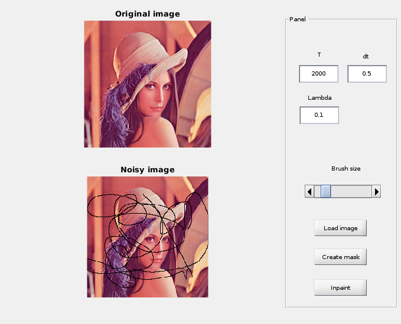
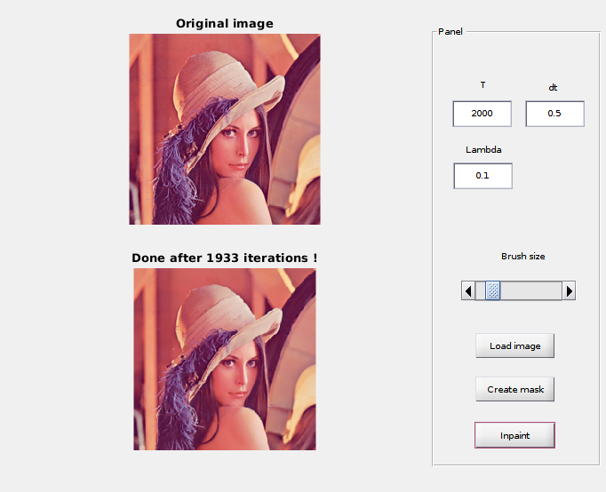

# Total Variation Inpainting

Inpainting is the process of restoring damaged images. Ultimately the goal is to present the image as it was created. The method implemented is based on heat equation and its goal is to minimize the energy in the given image. Indeed, high energy means that we have important disparities in the image.

If you're interested, you can find out more in my report.

## How to use

1. git clone https://github.com/StephaneSobucki/Total-variation-Inpainting
2. run main.m script in Matlab
3. Load your image
4. Set parameters for inpainting (T: total time, dt: timestep, lambda: fidelity coefficient)
5. Create mask
6. Inpaint

## Dependencies

To draw the mask, you have to install the Image Processing Toolbox.

## Example

